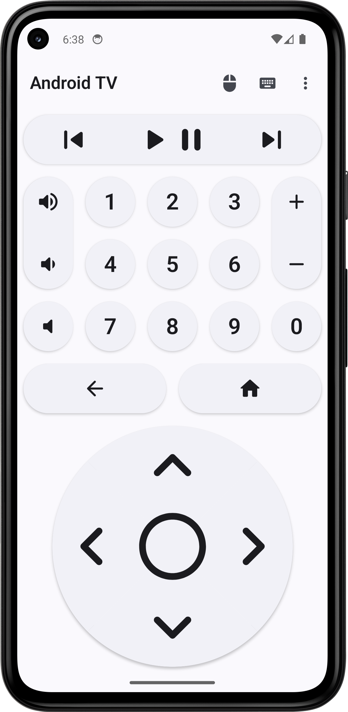
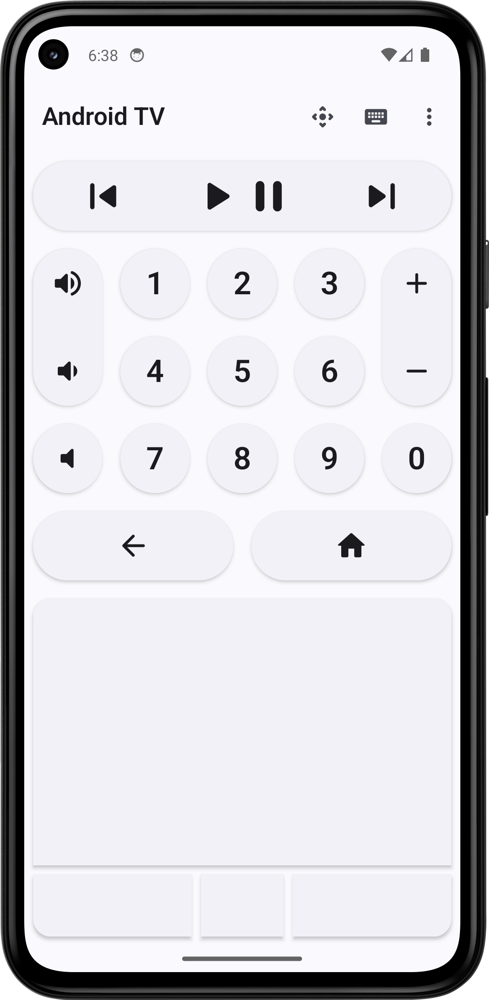
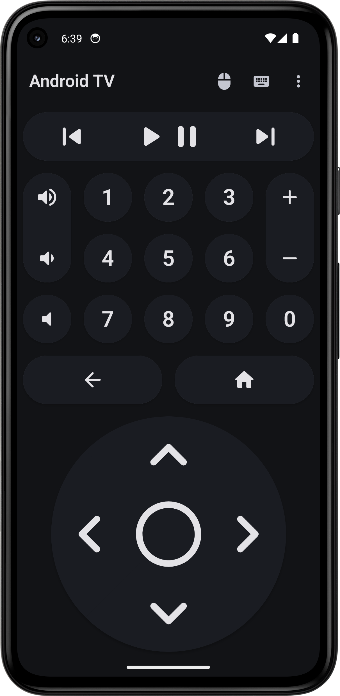
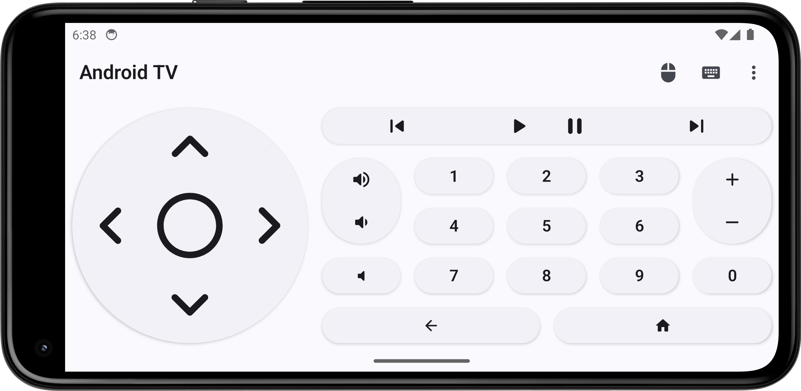
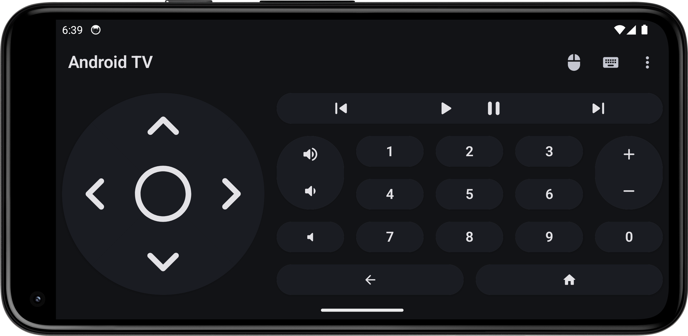

## 
BT Remote

<h4>An Android app that turns your smartphone into a Bluetooth remote for Android TV.</h4>

## Description

Turn your smartphone into a Bluetooth remote control to easily navigate and interact with your Android TV.

Features:

- Wireless control via Bluetooth connection.
- Includes all necessary buttons for remote control of your device.
- Support for integrated mouse and keyboard.
- No additional app installation required on your Android TV device thanks to HID protocol.
- Modern and responsive user interface.
- Developed with Kotlin, Jetpack Compose, and Material 3.
- Privacy-focused with no data collection (internet permission disabled).
- No advertisements.
- Open source.

## Screenshots

## Donate

If you like BT Remote, you can support me via [Liberapay](https://liberapay.com/Atharok/donate) or [Ko-fi](https://ko-fi.com/atharok).

## Contribution

If you want to translate the app, please submit a merge request on GitLab.
If you have any questions regarding contributions or translations, feel free to open an issue or contact me by [e-mail](mailto:atharok@duck.com).

## Licences

The code is licensed under the [GPLv3](https://www.gnu.org/licenses/gpl-3.0).

Dependencies:

- [Core KTX](https://github.com/androidx/androidx) is licensed under [Apache License 2.0](https://www.apache.org/licenses/LICENSE-2.0)
- [Activity Compose](https://github.com/androidx/androidx) is licensed under [Apache License 2.0](https://www.apache.org/licenses/LICENSE-2.0)
- [Compose BOM](https://github.com/androidx/androidx) is licensed under [Apache License 2.0](https://www.apache.org/licenses/LICENSE-2.0)
- [Compose UI](https://github.com/androidx/androidx) is licensed under [Apache License 2.0](https://www.apache.org/licenses/LICENSE-2.0)
- [Compose UI Graphics](https://github.com/androidx/androidx) is licensed under [Apache License 2.0](https://www.apache.org/licenses/LICENSE-2.0)
- [Compose Material 3](https://github.com/androidx/androidx) is licensed under [Apache License 2.0](https://www.apache.org/licenses/LICENSE-2.0)
- [Compose Material Icons Extended](https://github.com/androidx/androidx) is licensed under [Apache License 2.0](https://www.apache.org/licenses/LICENSE-2.0)
- [Lifecycle Runtime Compose](https://github.com/androidx/androidx) is licensed under [Apache License 2.0](https://www.apache.org/licenses/LICENSE-2.0)
- [Navigation Compose](https://github.com/androidx/androidx) is licensed under [Apache License 2.0](https://www.apache.org/licenses/LICENSE-2.0)
- [DataStore Preferences](https://github.com/androidx/androidx) is licensed under [Apache License 2.0](https://www.apache.org/licenses/LICENSE-2.0)
- [Koin AndroidX Compose](https://github.com/InsertKoinIO/koin) is licensed under [Apache License 2.0](https://www.apache.org/licenses/LICENSE-2.0)
